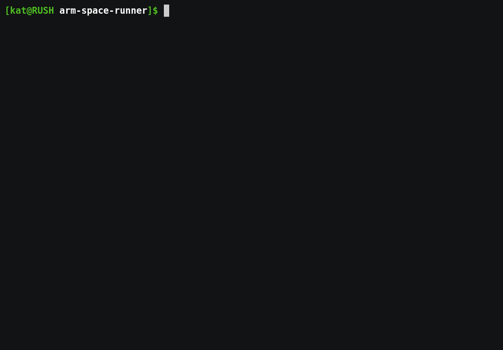

## A terminal based mini game made in ARM assembly

### Current state
Right now, the game is functionnal but one has to set all the options in the source files directly (in the .data section).
Each commit may have different settings (average lasers' speed, spaceship speed, view size, ...) so the difficulty is pretty random depending on when you pulled the code.

## Running the game
Assuming all Makefile dependencies are fulfilled
- 'make' or 'make compile' compiles the program (if not compiled already)
- 'make run' compiles the program (if not compiled already) and runs it

### Dependencies needed
The game only relies on syscalls (it uses getrandom, Kernel version >= 3.17 required).  
To compile & execute the program, one needs:
- a cross compiler for ARM (or a compiler if one is on an ARM architecture), the Makefile uses 'arm-none-eabi-as' & 'arm-none-eabi-ld' from the 'arm-none-eabi' archlinux package
- a way to emulate an ARM CPU (if one isn't already on an ARM architecture), the Makefile uses 'qemu-arm' from the 'qemu' archlinux package

### How to play
- Avoid the lasers and survive as long as possible in your tiny spaceship (@).
- If you want to quit, press q (Ctrl+C doesn't leave non-canonical mode yet, your terminal will be weird if you don't quit properly).

### Settings
As explained in the "Current state" section, the settings are hardcoded in the source files (in the .data section). Here we explain how some can be changed:
- Right now the only controls supported but default are "wasd" but they can be changed by mapping the right keycode in the src/spaceship.s's .data section.
- The spaceship's & lasers' speed is determined by the number of ticks between position updates, this can be changed in the src/spaceship.s's and src/lasers.s's .data section (a smalled number of tick between updates -> a higher speed) (attributes to change are update\_laser\_tick\_delta\_{min, max} and move\_spaceship\_tick\_delta).
- The frequency at which new lasers are added can be modified in the src/lasers.s's .data section (attribute to change is add\_laser\_tick\_delta).

## TODO
- Print a proper Game over screen
- Improve spaceship control
- Improve lasers graphics : add some color
- Add options to change the "screen" size, lasers generation and the number of ships in the game as well as their starting position and their controls, first at compile time then as arguments
- Option to add multiple spaceships with different or the same controls (so the same movements) + add configurable rule on weather one loses when all spaceships are hit or just one + option to change spaceships' character display to multi character shapes defined by the user
- Improve the screen printing by using 2 buffers: one that is modified by the user (me) and one that represents the currently printed screen. Updating the screen would only need to apply the differences between the two and would be much more efficient (ncurses like). This could still be done in 1 write syscall with a pattern such as "code\_to\_move\_cursor-update-code\_to\_move\_cursor-update-...).
- Fix bug that causes (0, 0) to be a position where the spaceship disapears (and the player automatically loses). This is caused by view's write\_char\_to\_buffer and get\_char\_from\_buffer who add 1 to the final position compensate for the home ("\x1b[H") character that seems to take some place. This bug might be automatically fixed when the screen update is improved (see just above).
